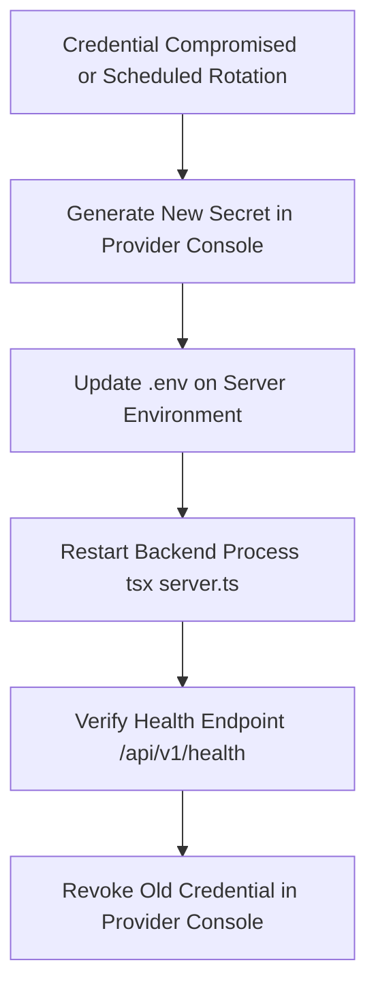

# EduCore Single-School Management System — Secrets Management & Exposure Analysis

**Project:** EduCore Single-School Management System  
**Document Location:** `brain/security/secrets.md`  
**Assessment Date:** 2026-10-07  
**Scope:** Complete project codebase (`.env`, `.env.example`, `server/src/config/env.ts`, `server/src/config/supabase.ts`, frontend client files, git repository history, build output)

---

## 1. Secrets Inventory & Expected Locations

The system requires several classes of credentials across database access, authentication, cloud storage, and communication pipelines:

| Secret Identifier | Category | Expected Location | Exposure Scope | Sensitivity |
|---|---|---|---|---|
| `SUPABASE_SERVICE_ROLE_KEY` | Database / Auth Master Key | Server `.env` | Backend Server ONLY | **Critical** (Bypasses all PostgreSQL Row Level Security; root auth admin rights) |
| `Database Connection Password` | Direct Database Password | Supabase DB Settings / External Connection URL | Database Drivers ONLY | **Critical** (Provides full PostgreSQL superuser/admin shell) |
| `JWT_SECRET` | Token Signing Secret | Server `.env` | Backend Server ONLY | **High** (Signs and verifies HMAC-SHA256 session tokens) |
| `CLOUDINARY_API_SECRET` | Cloud Media Storage Secret | Server `.env` | Backend Server ONLY | **High** (Enables asset deletion, overwrite, and API administration) |
| `CLOUDINARY_API_KEY` | Cloud Media Storage Key | Server `.env` | Backend Server ONLY | **Medium** (Used alongside API secret for authenticated uploads) |
| `RAZORPAY_KEY_SECRET` | Financial Gateway Secret | Server `.env` | Backend Server ONLY | **Critical** (Processes payments, verifies webhook signatures, triggers refunds) |
| `RAZORPAY_KEY_ID` | Financial Gateway Public ID | Server `.env` | Server & Client | **Medium** (Public merchant identifier) |
| `SMS_API_SECRET` / `SMS_API_KEY` | SMS Messaging Gateway | Server `.env` | Backend Server ONLY | **Medium** (Sends SMS alerts to parents/staff) |
| `WHATSAPP_API_TOKEN` | Meta WhatsApp Cloud API | Server `.env` | Backend Server ONLY | **High** (Sends transactional messages to parents) |
| `EMAIL_PASSWORD` / `EMAIL_USER` | SMTP Credentials | Server `.env` | Backend Server ONLY | **High** (Delivers password resets, reports, and system emails) |
| `GEMINI_API_KEY` | AI Model Integration | Server `.env` | Backend Server ONLY | **Medium** (Calls Google GenAI API) |
| `SUPABASE_ANON_KEY` | Public Client API Key | Client & Server `.env` | Public / Client-Safe | **Low-Medium** (Public client key constrained by Row Level Security) |
| `SUPABASE_URL` | Supabase Project Host | Client & Server `.env` | Public / Client-Safe | **Low** (Project HTTPS domain) |

---

## 2. Environment & Configuration Handling

### 2.1 Backend Environment Loading (`server/src/config/env.ts`)
- **Mechanism:** The backend invokes `dotenv.config()` at boot in [server/src/config/env.ts:7](file:///d:/school-management-systems/server/src/config/env.ts#L7).
- **Structure:** Encapsulated in the frozen `ENV` singleton.
- **Production Assertion for JWT Secret:**
  [server/src/config/env.ts:28-39](file:///d:/school-management-systems/server/src/config/env.ts#L28-L39) enforces strict production constraints:
  ```typescript
  JWT_SECRET: (() => {
    const secret = process.env.JWT_SECRET || '';
    if (process.env.NODE_ENV === 'production') {
      if (!secret || secret.length < 32 || secret.includes('change-in-prod')) {
        throw new Error(
          'FATAL SECURITY: In production, JWT_SECRET must be explicitly set to a random string of at least 32 characters in .env'
        );
      }
      return secret;
    }
    return secret || 'single-school-sys-secret-jwt-key-change-in-prod-32-chars';
  })()
  ```
  *Analysis:* In production (`NODE_ENV === 'production'`), boot halts immediately if the secret is missing, under 32 characters, or contains the placeholder string.

### 2.2 Critical Configuration Risk: Fallback to Anon Key for Admin Client
- **Code Evidence:** [server/src/config/supabase.ts:21-27](file:///d:/school-management-systems/server/src/config/supabase.ts#L21-L27):
  ```typescript
  const adminKey = ENV.SUPABASE_SERVICE_ROLE_KEY || ENV.SUPABASE_ANON_KEY;
  supabaseAdmin = createClient(ENV.SUPABASE_URL, adminKey, {
    auth: { persistSession: false, autoRefreshToken: false },
  });
  ```
- **Risk:** If `SUPABASE_SERVICE_ROLE_KEY` is omitted or typoed in `.env`, the server silently falls back to `SUPABASE_ANON_KEY`. Consequently, backend calls made through `supabaseAdmin` will execute with anonymous privileges, causing administrative queries to fail or return partial data under RLS.
- **Classification:** Security Weakness.

---

## 3. Hardcoded Secret Analysis

### 3.1 Codebase Audit Findings
A comprehensive regex search across all source files (`server/**`, `src/**`, `database/**`) confirmed:
1. **No Live Secrets Committed:** No live API keys, JWT tokens, private certificates, or production credentials exist in version control.
2. **Development Fallback Constant:** `server/src/config/env.ts:38` contains the hardcoded string `'single-school-sys-secret-jwt-key-change-in-prod-32-chars'` strictly scoped to development mode (`NODE_ENV !== 'production'`).
3. **UI Demonstration Placeholders:** `src/modules/setup/SupabaseSetupGuideModal.tsx:28-34` contains non-functional documentation placeholders (`NEXT_PUBLIC_SUPABASE_ANON_KEY=eyJhbGciOi...`).

---

## 4. Client-Side Exposure Analysis

### 4.1 Vite Bundling Scope (`import.meta.env`)
- Vite bundles only variables explicitly prefixed with `VITE_` into client-side JavaScript bundles:
  - `VITE_SUPABASE_URL` → Exposed in client bundle (Expected for Supabase client initialization).
  - `VITE_SUPABASE_ANON_KEY` → Exposed in client bundle (Expected for Supabase client initialization).
- Variables without the prefix (`SUPABASE_SERVICE_ROLE_KEY`, `JWT_SECRET`, `CLOUDINARY_API_SECRET`, `RAZORPAY_KEY_SECRET`) are **never bundled** into the client build.

### 4.2 Browser Storage Exposure (`localStorage`)
- **Code Evidence:** [src/lib/api.ts:13 & 21](file:///d:/school-management-systems/src/lib/api.ts#L13) and [src/hooks/useAuth.tsx:148](file:///d:/school-management-systems/src/hooks/useAuth.tsx#L148):
  ```typescript
  localStorage.setItem('educore_auth_token', token);
  ```
- **Risk Assessment:** Storing authentication tokens in `localStorage` exposes them to any client-side JavaScript execution context. If any Cross-Site Scripting (XSS) occurs via user profile fields, student notes, or compromised third-party dependencies, the attacker can exfiltrate `educore_auth_token` immediately.
- **Classification:** Security Weakness.

---

## 5. Git & History Exposure Analysis

### 5.1 Git Ignore Verification (`.gitignore`)
- [/.gitignore:7-8](file:///d:/school-management-systems/.gitignore#L7-L8) contains:
  ```gitignore
  .env*
  !.env.example
  ```
- **Verification:** Verified via `git status` and `git check-ignore -v .env`. Active `.env` files are properly excluded from version tracking.

### 5.2 Commit History Audit
- Verified via `git log --all --full-history -- "**.env*"`:
  - Commit `76bc016`: Added `.env.example` containing clean, empty placeholder templates.
  - Commit `cf44452`: Initial repository initialization.
  - **Result:** No `.env` files with real keys were ever committed to Git history.

### 5.3 External Disclosure Event (Chat History)
- **Event:** The Supabase database connection password was shared in plaintext during developer conversational interactions on 2026-10-07.
- **Impact:** The secret was transmitted across external API boundaries.
- **Action Required:** Immediate rotation of the database password in the Supabase Cloud console.

---

## 6. Logging & Error Exposure Analysis

### 6.1 Server Startup Logging (`server.ts`)
- [server.ts:128](file:///d:/school-management-systems/server.ts#L128) logs:
  `Supabase Configured: ${ENV.isSupabaseConfigured() ? 'YES (Live Supabase Auth & DB)' : 'NO (Using In-Memory Demo Mode)'}`
  *Analysis:* Logs boolean status only. No credentials, tokens, or connection strings are logged.

### 6.2 Public Status API (`server/src/modules/auth/auth.controller.ts`)
- [auth.controller.ts:19](file:///d:/school-management-systems/server/src/modules/auth/auth.controller.ts#L19) returns:
  `supabaseUrl: ENV.SUPABASE_URL ? `${ENV.SUPABASE_URL.substring(0, 15)}...` : null`
  *Analysis:* Truncates the URL to 15 characters. Does not return keys or full hostnames.

### 6.3 Unhandled Error Logging (`server/src/middleware/error.middleware.ts`)
- [error.middleware.ts:12-27](file:///d:/school-management-systems/server/src/middleware/error.middleware.ts#L12-L27):
  ```typescript
  console.error('Unhandled Server Error:', {
    timestamp: new Date().toISOString(),
    message: err.message,
    stack: err.stack,
    code: err.code,
    status: err.status || err.statusCode,
  });
  ```
  - **In Production:** Masked to a generic string (`'An internal server error occurred...'`).
  - **In Development:** Returns `err.message` to the client. If a database query fails with a connection error containing connection strings, credentials could be reflected in the response in development mode.

---

## 7. Secret Rotation Procedures & Runbook

When any credential is leaked, rotated periodically, or compromised, execute the following operational sequence:



### 7.1 Supabase Service Role Key Rotation
1. Log in to Supabase Dashboard > Project Settings > API.
2. Click **Rotate JWT Secret** (Note: this invalidates all active user sessions and service role keys).
3. Copy the newly generated `service_role` secret.
4. Update `SUPABASE_SERVICE_ROLE_KEY` in production `.env`.
5. Restart the Node.js process: `npm run dev` / systemd / PM2.
6. Verify via `GET /api/v1/auth/status`.

### 7.2 Database Password Rotation
1. Log in to Supabase Dashboard > Project Settings > Database.
2. Click **Reset Database Password**.
3. Generate a cryptographically secure 32+ character random password.
4. Update connection strings in backend deployment environments.

### 7.3 Application JWT Secret Rotation
1. Generate random key: `node -e "console.log(require('crypto').randomBytes(32).toString('hex'))"`.
2. Update `JWT_SECRET` in `.env`.
3. Restart application. Active application sessions will require re-login.

### 7.4 Cloudinary API Key & Secret Rotation
1. Log in to Cloudinary Console > Settings > Access Keys.
2. Generate secondary API Key/Secret.
3. Update `CLOUDINARY_API_KEY` and `CLOUDINARY_API_SECRET` in `.env`.
4. Test photo upload via `POST /api/v1/students/:id/photo`.
5. Delete old API key in Cloudinary Console.

---

## 8. Specific Findings & Evidence

### Confirmed Vulnerabilities
1. **Plaintext Database Password Shared Externally:**
   - **Severity:** High
   - **Evidence:** Password previously pasted in developer conversation.
   - **Risk:** Direct remote PostgreSQL compromise bypassing Express security controls.
   - **Affected Location:** Supabase Database Infrastructure.
   - **Why It Matters:** Database passwords provide unrestricted administrative access.
   - **Recommended Fix:** Reset database password immediately in Supabase Project Settings > Database.

### Security Weaknesses
1. **Silent Fallback from Service Role Key to Anon Key:**
   - **Severity:** Medium
   - **Evidence:** `server/src/config/supabase.ts:21` (`const adminKey = ENV.SUPABASE_SERVICE_ROLE_KEY || ENV.SUPABASE_ANON_KEY;`).
   - **Risk:** Silent privilege degradation causing broken administrative functions instead of failing fast.
   - **Affected Location:** `server/src/config/supabase.ts`.
   - **Why It Matters:** The backend expects service role privileges; operating under anon privileges causes unexpected RLS failures.
   - **Recommended Fix:** Throw an explicit configuration error if `SUPABASE_SERVICE_ROLE_KEY` is missing in live mode.
2. **Session Token Stored in `localStorage`:**
   - **Severity:** High
   - **Evidence:** `src/lib/api.ts:13` (`localStorage.setItem('educore_auth_token', token)`).
   - **Risk:** XSS-mediated token exfiltration.
   - **Affected Location:** `src/lib/api.ts`.
   - **Why It Matters:** Any JavaScript injection compromises the entire user account.
   - **Recommended Fix:** Transition to `HttpOnly` secure cookies for browser session management.

### Missing Controls
1. **Automated Secret Scanning in CI/CD:**
   - **Severity:** Medium
   - **Evidence:** No pre-commit hooks (`husky` / `gitleaks`) or CI workflow checking for accidental commits of credentials.
   - **Risk:** Accidental commit of `.env` or API keys during rapid development.
   - **Affected Location:** Repository root / Git hooks.
   - **Why It Matters:** Human error is the primary cause of credential leaks.
   - **Recommended Fix:** Install `gitleaks` or a pre-commit hook scanning for entropy and credential patterns.

### Potential Risks Requiring Verification
1. **Reflected Error Messages in Development Mode:**
   - **Severity:** Low-Medium
   - **Evidence:** `server/src/middleware/error.middleware.ts:24` returns `err.message` when `NODE_ENV !== 'production'`.
   - **Risk:** Leaks database hostnames or internal connection strings in development debug sessions.
   - **Affected Location:** `server/src/middleware/error.middleware.ts`.
   - **Why It Matters:** Prevents accidental leakage during shared dev sessions.
   - **Recommended Fix:** Sanitize connection strings from all error messages before returning them to clients.
