# School Management System
## Database Design & Architecture — Single School

> **Project Type:** School Management System  
> **Architecture:** Single School  
> **Database:** PostgreSQL  
> **ORM:** Prisma  
> **Backend:** Node.js + TypeScript  
> **Frontend:** React / Next.js  
> **Authentication:** JWT + RBAC  
> **Storage:** S3 / Cloud Storage

---

# 1. Project Overview

This project is a complete **School Management System (SMS)** designed for **one school**.

The system manages:

- Students
- Parents
- Teachers and Staff
- Classes and Sections
- Academic Years
- Subjects
- Attendance
- Timetable
- Homework
- Examinations
- Marks and Results
- Fees and Payments
- Library
- Transport
- Inventory
- Leave Management
- Notices and Notifications
- Events
- Certificates and Documents
- User Roles and Permissions
- Audit Logs

The system should maintain complete historical records.

For example, when a student moves from:

```text
2025-26 → Class 7-A
2026-27 → Class 8-B
2027-28 → Class 9-A
```

the old academic information must **not be overwritten**.

---

# 2. Important Architecture Decision

This is a **single-school system**.

Therefore, we DO NOT need:

```text
schools table
school_id in every table
multi-tenant architecture
campus management
school subscriptions
tenant isolation
```

Instead, basic school information is stored in:

```text
school_settings
```

Example:

```text
school_settings
        │
        ├── School Name
        ├── Address
        ├── Phone
        ├── Email
        ├── Logo
        ├── Principal
        └── Current Academic Session
```

---

# 3. High-Level Architecture

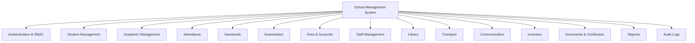

---

# 4. User Roles

The system supports different users.

```text
                    SCHOOL SYSTEM
                         │
       ┌─────────────────┼─────────────────┐
       │                 │                 │
     ADMIN             TEACHER           PARENT
       │                 │                 │
       │                 │                 └── Student Information
       │                 │
       │                 ├── Attendance
       │                 ├── Homework
       │                 ├── Exams
       │                 └── Marks
       │
       ├── Students
       ├── Teachers
       ├── Fees
       ├── Classes
       ├── Reports
       └── Settings
```

Recommended roles:

```text
ADMIN
PRINCIPAL
TEACHER
ACCOUNTANT
LIBRARIAN
RECEPTIONIST
PARENT
STUDENT
```

---

# 5. Complete Database Modules

The database is divided into the following modules:

```text
01. Authentication
02. Student Management
03. Parent Management
04. Academic Management
05. Staff Management
06. Attendance
07. Timetable
08. Homework
09. Examination
10. Fees
11. Library
12. Transport
13. Communication
14. Events
15. Inventory
16. Documents
17. Leave Management
18. School Settings
19. Audit Logs
```

---

# 6. Complete Table List

## Authentication

```text
users
roles
permissions
role_permissions
```

## Students

```text
students
parents
student_parents
student_documents
student_medical_records
```

## Academic

```text
academic_years
classes
sections
subjects
class_subjects
student_enrollments
teacher_assignments
```

## Attendance

```text
attendance
```

## Timetable

```text
timetable_periods
timetable
```

## Homework

```text
homework
homework_submissions
```

## Examination

```text
exams
exam_subjects
exam_marks
grading_systems
grade_rules
```

## Fees

```text
fee_categories
fee_structures
student_fee_assignments
fee_payments
fee_payment_items
fee_discounts
```

## Staff

```text
employees
employee_documents
employee_attendance
leave_types
leave_requests
```

## Library

```text
books
book_copies
library_transactions
library_fines
```

## Transport

```text
vehicles
drivers
routes
route_stops
student_transport
```

## Communication

```text
notices
notifications
notification_recipients
```

## Events

```text
events
```

## Inventory

```text
inventory_categories
inventory_items
inventory_transactions
```

## System

```text
school_settings
certificates
audit_logs
```

---

# 7. Core Database Relationship

The most important relationship in this system is:

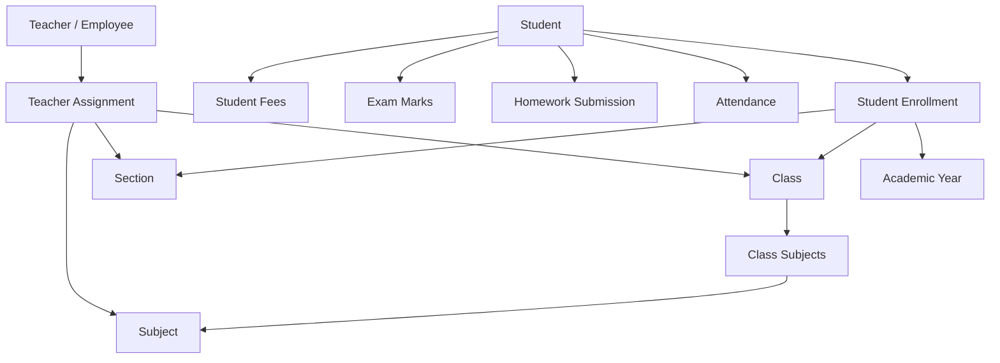

---

# 8. Student Data Flow

A student should NOT directly belong permanently to a class.

Instead:

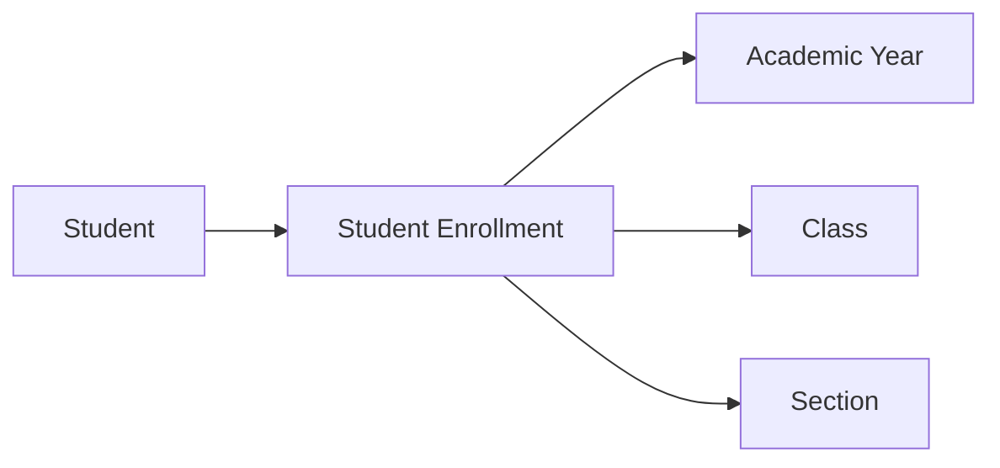

Example:

```text
Student:
Rahul Sharma

Enrollment History:

2024-25
    Class 6
    Section A

2025-26
    Class 7
    Section A

2026-27
    Class 8
    Section B
```

This allows complete academic history.

---

# 9. Why Enrollment Is Important

DO NOT design the student table like:

```text
students
----------------
id
name
class_id
section_id
```

This creates problems when the student is promoted.

Instead:

```text
students
    ↓
student_enrollments
    ↓
academic_year
class
section
```

The student record remains permanent while enrollment changes every academic year.

---

# 10. `users` Table

Used for login and authentication.

```text
users
------------------------------------------------
id                  UUID PK
username            VARCHAR UNIQUE
email               VARCHAR UNIQUE
phone               VARCHAR
password_hash       TEXT
first_name          VARCHAR
last_name           VARCHAR
profile_image       TEXT
status              VARCHAR
last_login_at       TIMESTAMP
created_at          TIMESTAMP
updated_at          TIMESTAMP
deleted_at          TIMESTAMP
```

Important:

Never store:

```text
password
```

Store:

```text
password_hash
```

Use:

```text
Argon2id
```

or:

```text
bcrypt
```

---

# 11. `roles`

```text
roles
------------------------------------------------
id                  UUID PK
name                VARCHAR
code                VARCHAR UNIQUE
description         TEXT
created_at          TIMESTAMP
```

Example:

```text
ADMIN
PRINCIPAL
TEACHER
ACCOUNTANT
LIBRARIAN
RECEPTIONIST
PARENT
STUDENT
```

---

# 12. `permissions`

```text
permissions
------------------------------------------------
id                  UUID PK
module              VARCHAR
action              VARCHAR
description         TEXT
```

Examples:

```text
student.create
student.read
student.update
student.delete

attendance.create
attendance.read
attendance.update

fees.create
fees.read
fees.refund
```

---

# 13. `role_permissions`

```text
role_permissions
------------------------------------------------
role_id             UUID FK
permission_id       UUID FK

PRIMARY KEY(role_id, permission_id)
```

Relationship:


---

# 14. `students`

This stores the student's permanent information.

```text
students
------------------------------------------------
id                  UUID PK
admission_number    VARCHAR UNIQUE
first_name          VARCHAR
middle_name         VARCHAR
last_name           VARCHAR
gender              VARCHAR
date_of_birth       DATE
blood_group         VARCHAR
nationality         VARCHAR
category            VARCHAR
photo_url            TEXT
phone               VARCHAR
email               VARCHAR
address             TEXT
city                VARCHAR
state               VARCHAR
pincode             VARCHAR
admission_date      DATE
status              VARCHAR
created_at          TIMESTAMP
updated_at          TIMESTAMP
deleted_at          TIMESTAMP
```

Example:

```text
Admission Number:
ADM-2026-00125
```

The admission number should remain unique.

---

# 15. `parents`

```text
parents
------------------------------------------------
id                  UUID PK
user_id             UUID FK
first_name          VARCHAR
last_name           VARCHAR
phone               VARCHAR
alternate_phone     VARCHAR
email               VARCHAR
occupation          VARCHAR
address             TEXT
city                VARCHAR
state               VARCHAR
pincode             VARCHAR
created_at          TIMESTAMP
updated_at          TIMESTAMP
```

---

# 16. `student_parents`

A student can have multiple parents.

A parent can have multiple children.

Therefore this is a many-to-many relationship.

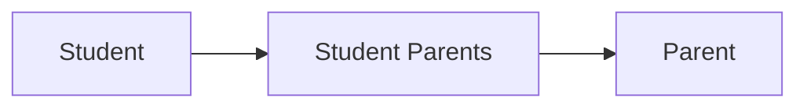

Table:

```text
student_parents
------------------------------------------------
student_id          UUID FK
parent_id           UUID FK
relationship        VARCHAR
is_primary          BOOLEAN
is_emergency        BOOLEAN
can_pickup          BOOLEAN

PRIMARY KEY(student_id, parent_id)
```

---

# 17. Academic Year

```text
academic_years
------------------------------------------------
id                  UUID PK
name                VARCHAR
start_date          DATE
end_date            DATE
is_current          BOOLEAN
status              VARCHAR
created_at          TIMESTAMP
```

Example:

```text
2025-26
2026-27
2027-28
```

Only one academic year should normally have:

```text
is_current = true
```

---

# 18. Classes

```text
classes
------------------------------------------------
id                  UUID PK
name                VARCHAR
code                VARCHAR UNIQUE
display_order       INTEGER
created_at          TIMESTAMP
```

Examples:

```text
Nursery
LKG
UKG
Class 1
Class 2
...
Class 12
```

---

# 19. Sections

```text
sections
------------------------------------------------
id                  UUID PK
name                VARCHAR
code                VARCHAR
capacity            INTEGER
created_at          TIMESTAMP
```

Examples:

```text
A
B
C
D
```

---

# 20. Student Enrollment

```text
student_enrollments
------------------------------------------------
id                  UUID PK
student_id          UUID FK
academic_year_id    UUID FK
class_id            UUID FK
section_id          UUID FK
roll_number         VARCHAR
enrollment_date     DATE
status              VARCHAR
promotion_status    VARCHAR
created_at          TIMESTAMP
updated_at          TIMESTAMP
```

Example:

```text
Rahul Sharma

2025-26
Class 7
Section A
Roll No: 12

2026-27
Class 8
Section B
Roll No: 17
```

---

# 21. Subjects

```text
subjects
------------------------------------------------
id                  UUID PK
name                VARCHAR
code                VARCHAR UNIQUE
subject_type        VARCHAR
max_marks           INTEGER
passing_marks       INTEGER
created_at          TIMESTAMP
```

Examples:

```text
MAT - Mathematics
ENG - English
SCI - Science
HIN - Hindi
SST - Social Science
COM - Computer
```

---

# 22. Class Subjects

```text
class_subjects
------------------------------------------------
id                  UUID PK
academic_year_id    UUID FK
class_id            UUID FK
subject_id          UUID FK
is_optional         BOOLEAN
created_at          TIMESTAMP
```

Relationship:

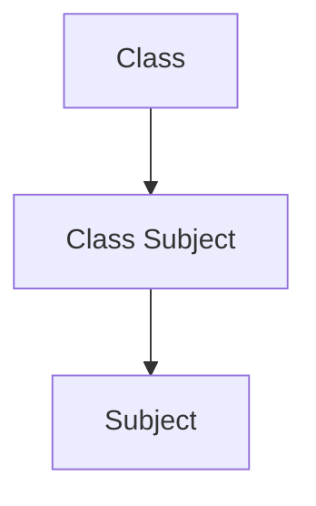

---

# 23. Employees

Teachers and other staff are stored here.

```text
employees
------------------------------------------------
id                  UUID PK
user_id             UUID FK
employee_code       VARCHAR UNIQUE
first_name          VARCHAR
last_name           VARCHAR
designation         VARCHAR
department          VARCHAR
joining_date        DATE
employment_type     VARCHAR
date_of_birth       DATE
gender              VARCHAR
phone               VARCHAR
email               VARCHAR
address             TEXT
salary              DECIMAL
status              VARCHAR
created_at          TIMESTAMP
updated_at          TIMESTAMP
deleted_at          TIMESTAMP
```

Examples:

```text
Teacher
Accountant
Librarian
Receptionist
Principal
Peon
Driver
Administrator
```

---

# 24. Teacher Assignment

```text
teacher_assignments
------------------------------------------------
id                  UUID PK
academic_year_id    UUID FK
employee_id         UUID FK
class_id            UUID FK
section_id          UUID FK
subject_id          UUID FK
is_class_teacher    BOOLEAN
created_at          TIMESTAMP
```

Example:

```text
Mr. Patel
    ↓
Class 8-A
    ↓
Mathematics
```

A teacher can teach multiple classes.

---

# 25. Attendance

```text
attendance
------------------------------------------------
id                  UUID PK
student_id          UUID FK
enrollment_id       UUID FK
attendance_date     DATE
status              VARCHAR
check_in_time       TIME
check_out_time      TIME
remarks             TEXT
marked_by           UUID FK
created_at          TIMESTAMP
updated_at          TIMESTAMP
```

Statuses:

```text
PRESENT
ABSENT
LATE
HALF_DAY
LEAVE
```

Important:

```text
UNIQUE(student_id, attendance_date)
```

This prevents duplicate attendance.

---

# 26. Attendance Flow

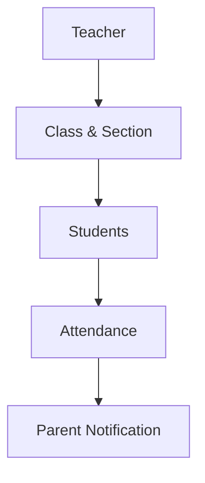

Example:

```text
Teacher
   ↓
Class 8-A
   ↓
06 Oct 2026
   ↓
Rahul → Present
Amit  → Absent
Priya → Present
   ↓
Parent notification for Amit
```

---

# 27. Timetable

## `timetable_periods`

```text
timetable_periods
------------------------------------------------
id                  UUID PK
name                VARCHAR
start_time          TIME
end_time            TIME
period_number       INTEGER
```

## `timetable`

```text
timetable
------------------------------------------------
id                  UUID PK
academic_year_id    UUID FK
class_id            UUID FK
section_id          UUID FK
subject_id          UUID FK
teacher_id          UUID FK
period_id           UUID FK
day_of_week         SMALLINT
room_number         VARCHAR
created_at          TIMESTAMP
```

---

# 28. Homework

```text
homework
------------------------------------------------
id                  UUID PK
academic_year_id    UUID FK
class_id            UUID FK
section_id          UUID FK
subject_id          UUID FK
teacher_id          UUID FK
title               VARCHAR
description         TEXT
assigned_date       DATE
due_date            DATE
attachment_url      TEXT
status              VARCHAR
created_at          TIMESTAMP
updated_at          TIMESTAMP
```

---

# 29. Homework Submission

```text
homework_submissions
------------------------------------------------
id                  UUID PK
homework_id         UUID FK
student_id          UUID FK
submitted_at        TIMESTAMP
attachment_url      TEXT
remarks             TEXT
marks               DECIMAL
status              VARCHAR
created_at          TIMESTAMP
```

Constraint:

```text
UNIQUE(homework_id, student_id)
```

---

# 30. Examination

## `exams`

```text
exams
------------------------------------------------
id                  UUID PK
academic_year_id    UUID FK
name                VARCHAR
exam_type            VARCHAR
start_date          DATE
end_date            DATE
status              VARCHAR
created_at          TIMESTAMP
```

Examples:

```text
Unit Test 1
Mid Term
Semester 1
Final Exam
Pre Board
```

---

# 31. Exam Subjects

```text
exam_subjects
------------------------------------------------
id                  UUID PK
exam_id             UUID FK
class_id            UUID FK
subject_id          UUID FK
exam_date           DATE
start_time          TIME
end_time            TIME
max_marks            DECIMAL
passing_marks        DECIMAL
room_number         VARCHAR
```

---

# 32. Exam Marks

```text
exam_marks
------------------------------------------------
id                  UUID PK
exam_subject_id     UUID FK
student_id          UUID FK
marks_obtained      DECIMAL
grade               VARCHAR
remarks              TEXT
is_absent            BOOLEAN
entered_by           UUID FK
created_at          TIMESTAMP
updated_at          TIMESTAMP
```

Important:

```text
UNIQUE(exam_subject_id, student_id)
```

This prevents duplicate marks.

---

# 33. Grading System

## `grading_systems`

```text
grading_systems
------------------------------------------------
id                  UUID PK
name                VARCHAR
```

## `grade_rules`

```text
grade_rules
------------------------------------------------
id                  UUID PK
grading_system_id   UUID FK
min_percentage      DECIMAL
max_percentage      DECIMAL
grade               VARCHAR
grade_point         DECIMAL
description         VARCHAR
```

Example:

```text
90-100 → A+
80-89  → A
70-79  → B+
60-69  → B
50-59  → C
40-49  → D
<40    → F
```

---

# 34. Examination Relationship

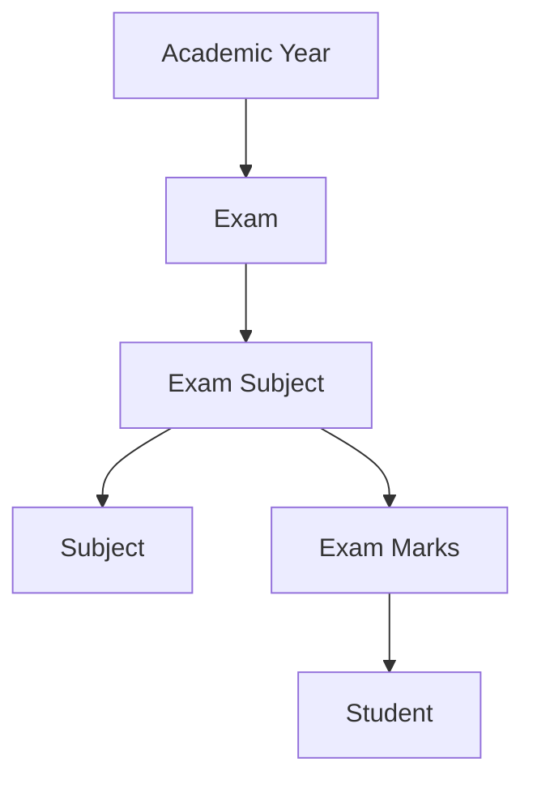

---

# 35. Fees Architecture

Fees should support:

- Full payment
- Partial payment
- Multiple payments
- Discounts
- Late fees
- Payment receipts
- Online payments
- Cash payments
- UPI
- Bank transfer

---

# 36. Fee Categories

```text
fee_categories
------------------------------------------------
id                  UUID PK
name                VARCHAR
code                VARCHAR UNIQUE
description         TEXT
```

Examples:

```text
TUITION
TRANSPORT
EXAM
LIBRARY
ACTIVITY
ADMISSION
```

---

# 37. Fee Structures

```text
fee_structures
------------------------------------------------
id                  UUID PK
academic_year_id    UUID FK
class_id            UUID FK
fee_category_id     UUID FK
amount              DECIMAL
frequency            VARCHAR
due_date             DATE
late_fee_amount     DECIMAL
created_at          TIMESTAMP
```

Frequency:

```text
MONTHLY
QUARTERLY
HALF_YEARLY
YEARLY
ONE_TIME
```

---

# 38. Student Fee Assignment

```text
student_fee_assignments
------------------------------------------------
id                  UUID PK
student_id          UUID FK
fee_structure_id    UUID FK
amount              DECIMAL
discount_amount     DECIMAL
net_amount          DECIMAL
due_date             DATE
status              VARCHAR
created_at          TIMESTAMP
```

---

# 39. Fee Payments

```text
fee_payments
------------------------------------------------
id                  UUID PK
student_id          UUID FK
receipt_number      VARCHAR UNIQUE
payment_date        TIMESTAMP
amount              DECIMAL
payment_method      VARCHAR
transaction_id      VARCHAR
gateway             VARCHAR
status              VARCHAR
collected_by        UUID FK
remarks             TEXT
created_at          TIMESTAMP
```

Payment methods:

```text
CASH
UPI
CARD
BANK_TRANSFER
CHEQUE
ONLINE
```

---

# 40. Fee Payment Items

```text
fee_payment_items
------------------------------------------------
id                  UUID PK
payment_id          UUID FK
student_fee_id      UUID FK
amount              DECIMAL
```

Example:

```text
Total Fee: ₹30,000

Payment 1:
₹10,000

Payment 2:
₹5,000

Payment 3:
₹15,000

Remaining:
₹0
```

---

# 41. Fee Relationship Diagram

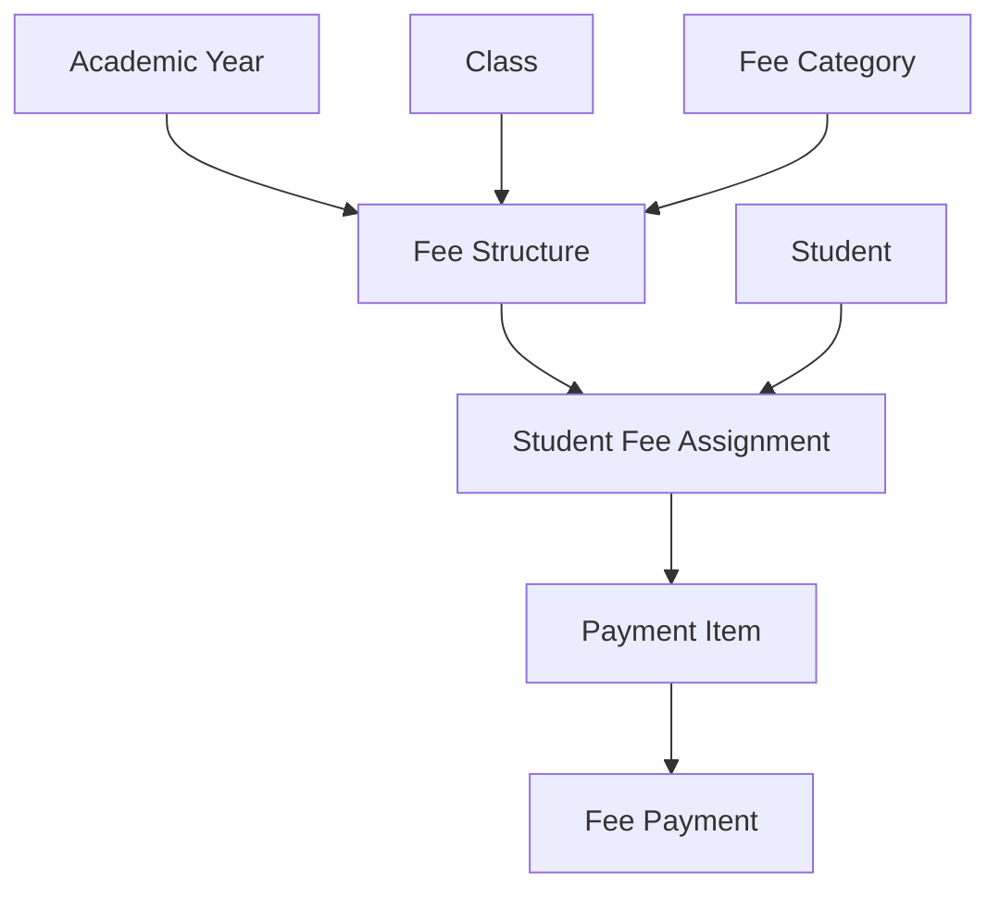

---

# 42. Library

## Books

```text
books
------------------------------------------------
id                  UUID PK
isbn                VARCHAR
title               VARCHAR
author              VARCHAR
publisher           VARCHAR
category            VARCHAR
language            VARCHAR
created_at          TIMESTAMP
```

## Book Copies

```text
book_copies
------------------------------------------------
id                  UUID PK
book_id             UUID FK
barcode             VARCHAR UNIQUE
accession_number    VARCHAR UNIQUE
condition           VARCHAR
status              VARCHAR
```

A book can have multiple physical copies.

Example:

```text
Atomic Habits

Copy 001 → Available
Copy 002 → Issued
Copy 003 → Damaged
```

## Library Transactions

```text
library_transactions
------------------------------------------------
id                  UUID PK
book_copy_id        UUID FK
student_id          UUID FK NULL
employee_id         UUID FK NULL
issued_at           TIMESTAMP
due_date             DATE
returned_at         TIMESTAMP
status              VARCHAR
issued_by            UUID FK
returned_by         UUID FK
```

---

# 43. Transport

## Vehicles

```text
vehicles
------------------------------------------------
id                  UUID PK
vehicle_number      VARCHAR UNIQUE
vehicle_type        VARCHAR
capacity            INTEGER
model               VARCHAR
insurance_expiry    DATE
fitness_expiry      DATE
status              VARCHAR
```

## Drivers

```text
drivers
------------------------------------------------
id                  UUID PK
employee_id         UUID FK NULL
name                VARCHAR
phone               VARCHAR
license_number      VARCHAR
license_expiry      DATE
status              VARCHAR
```

## Routes

```text
routes
------------------------------------------------
id                  UUID PK
name                VARCHAR
vehicle_id          UUID FK
driver_id            UUID FK
start_point         VARCHAR
end_point           VARCHAR
status              VARCHAR
```

## Route Stops

```text
route_stops
------------------------------------------------
id                  UUID PK
route_id            UUID FK
name                VARCHAR
sequence_number     INTEGER
pickup_time         TIME
drop_time           TIME
latitude            DECIMAL
longitude           DECIMAL
```

## Student Transport

```text
student_transport
------------------------------------------------
id                  UUID PK
student_id          UUID FK
route_id            UUID FK
stop_id             UUID FK
academic_year_id    UUID FK
pickup_required     BOOLEAN
drop_required       BOOLEAN
status              VARCHAR
```

---

# 44. Communication

## Notices

```text
notices
------------------------------------------------
id                  UUID PK
title               VARCHAR
content             TEXT
notice_type         VARCHAR
published_by        UUID FK
publish_at           TIMESTAMP
expires_at          TIMESTAMP
status              VARCHAR
created_at          TIMESTAMP
```

## Notifications

```text
notifications
------------------------------------------------
id                  UUID PK
title               VARCHAR
message             TEXT
type                VARCHAR
created_by          UUID FK
created_at          TIMESTAMP
```

## Notification Recipients

```text
notification_recipients
------------------------------------------------
id                  UUID PK
notification_id     UUID FK
user_id             UUID FK
is_read             BOOLEAN
read_at             TIMESTAMP
```

---

# 45. Inventory

## Categories

```text
inventory_categories
------------------------------------------------
id                  UUID PK
name                VARCHAR
```

## Items

```text
inventory_items
------------------------------------------------
id                  UUID PK
category_id         UUID FK
name                VARCHAR
sku                 VARCHAR
quantity             DECIMAL
unit                VARCHAR
minimum_stock       DECIMAL
location             VARCHAR
status              VARCHAR
```

## Transactions

```text
inventory_transactions
------------------------------------------------
id                  UUID PK
item_id             UUID FK
transaction_type    VARCHAR
quantity            DECIMAL
performed_by        UUID FK
created_at          TIMESTAMP
```

Types:

```text
PURCHASE
ISSUE
RETURN
ADJUSTMENT
DAMAGE
DISPOSAL
```

---

# 46. Employee Attendance

```text
employee_attendance
------------------------------------------------
id                  UUID PK
employee_id         UUID FK
attendance_date     DATE
status              VARCHAR
check_in_time       TIME
check_out_time      TIME
remarks             TEXT
created_at          TIMESTAMP
```

Constraint:

```text
UNIQUE(employee_id, attendance_date)
```

---

# 47. Leave Management

## `leave_types`

```text
leave_types
------------------------------------------------
id                  UUID PK
name                VARCHAR
max_days             INTEGER
```

Examples:

```text
CASUAL
SICK
EMERGENCY
PAID
```

## `leave_requests`

```text
leave_requests
------------------------------------------------
id                  UUID PK
user_id             UUID FK
leave_type_id       UUID FK
start_date          DATE
end_date            DATE
reason              TEXT
status              VARCHAR
approved_by         UUID FK
approved_at         TIMESTAMP
created_at          TIMESTAMP
```

---

# 48. Documents

Student documents:

```text
student_documents
------------------------------------------------
id                  UUID PK
student_id          UUID FK
document_type       VARCHAR
document_name       VARCHAR
file_url             TEXT
uploaded_by         UUID FK
uploaded_at         TIMESTAMP
```

Examples:

```text
Birth Certificate
Aadhaar
Transfer Certificate
Previous Marksheet
Medical Certificate
```

---

# 49. Certificates

```text
certificates
------------------------------------------------
id                  UUID PK
student_id          UUID FK
certificate_type    VARCHAR
certificate_number  VARCHAR
issued_date         DATE
file_url             TEXT
issued_by            UUID FK
created_at          TIMESTAMP
```

Examples:

```text
Bonafide Certificate
Character Certificate
Transfer Certificate
Leaving Certificate
```

---

# 50. School Settings

Because this is a single-school application:

```text
school_settings
------------------------------------------------
id                  UUID PK
school_name         VARCHAR
school_code         VARCHAR
logo_url             TEXT
email               VARCHAR
phone               VARCHAR
address              TEXT
city                VARCHAR
state               VARCHAR
pincode              VARCHAR
website              VARCHAR
principal_name      VARCHAR
academic_session    VARCHAR
currency             VARCHAR
timezone             VARCHAR
created_at          TIMESTAMP
updated_at          TIMESTAMP
```

---

# 51. Audit Logs

Every important action should be recorded.

```text
audit_logs
------------------------------------------------
id                  UUID PK
user_id             UUID FK
action              VARCHAR
entity_type         VARCHAR
entity_id           UUID
old_values          JSONB
new_values          JSONB
ip_address          INET
created_at          TIMESTAMP
```

Example:

```text
Teacher:
Mr. Patel

Action:
UPDATE

Entity:
exam_marks

Student:
Rahul Sharma

Old Marks:
75

New Marks:
82
```

This allows administrators to know **who changed what and when**.

---

# 52. Complete ER Diagram

```mermaid
erDiagram

    USERS ||--o{ ROLE_PERMISSIONS : has
    ROLES ||--o{ ROLE_PERMISSIONS : contains
    PERMISSIONS ||--o{ ROLE_PERMISSIONS : assigned

    USERS ||--o| PARENTS : represents
    USERS ||--o| EMPLOYEES : represents

    STUDENTS ||--o{ STUDENT_PARENTS : has
    PARENTS ||--o{ STUDENT_PARENTS : has

    STUDENTS ||--o{ STUDENT_ENROLLMENTS : enrolled
    ACADEMIC_YEARS ||--o{ STUDENT_ENROLLMENTS : contains
    CLASSES ||--o{ STUDENT_ENROLLMENTS : contains
    SECTIONS ||--o{ STUDENT_ENROLLMENTS : contains

    CLASSES ||--o{ CLASS_SUBJECTS : has
    SUBJECTS ||--o{ CLASS_SUBJECTS : assigned

    EMPLOYEES ||--o{ TEACHER_ASSIGNMENTS : teaches
    CLASSES ||--o{ TEACHER_ASSIGNMENTS : assigned
    SECTIONS ||--o{ TEACHER_ASSIGNMENTS : assigned
    SUBJECTS ||--o{ TEACHER_ASSIGNMENTS : teaches

    STUDENTS ||--o{ ATTENDANCE : has
    STUDENT_ENROLLMENTS ||--o{ ATTENDANCE : tracks
    USERS ||--o{ ATTENDANCE : marks

    CLASSES ||--o{ TIMETABLE : has
    SECTIONS ||--o{ TIMETABLE : has
    SUBJECTS ||--o{ TIMETABLE : has
    EMPLOYEES ||--o{ TIMETABLE : teaches
    TIMETABLE_PERIODS ||--o{ TIMETABLE : uses

    CLASSES ||--o{ HOMEWORK : receives
    SECTIONS ||--o{ HOMEWORK : receives
    SUBJECTS ||--o{ HOMEWORK : for
    EMPLOYEES ||--o{ HOMEWORK : creates

    HOMEWORK ||--o{ HOMEWORK_SUBMISSIONS : receives
    STUDENTS ||--o{ HOMEWORK_SUBMISSIONS : submits

    ACADEMIC_YEARS ||--o{ EXAMS : contains
    EXAMS ||--o{ EXAM_SUBJECTS : contains
    SUBJECTS ||--o{ EXAM_SUBJECTS : includes
    CLASSES ||--o{ EXAM_SUBJECTS : for
    EXAM_SUBJECTS ||--o{ EXAM_MARKS : records
    STUDENTS ||--o{ EXAM_MARKS : receives

    FEE_CATEGORIES ||--o{ FEE_STRUCTURES : defines
    CLASSES ||--o{ FEE_STRUCTURES : applies
    ACADEMIC_YEARS ||--o{ FEE_STRUCTURES : belongs

    STUDENTS ||--o{ STUDENT_FEE_ASSIGNMENTS : assigned
    FEE_STRUCTURES ||--o{ STUDENT_FEE_ASSIGNMENTS : creates

    STUDENT_FEE_ASSIGNMENTS ||--o{ FEE_PAYMENT_ITEMS : paid
    FEE_PAYMENTS ||--o{ FEE_PAYMENT_ITEMS : contains
    STUDENTS ||--o{ FEE_PAYMENTS : makes

    BOOKS ||--o{ BOOK_COPIES : contains
    BOOK_COPIES ||--o{ LIBRARY_TRANSACTIONS : used
    STUDENTS ||--o{ LIBRARY_TRANSACTIONS : borrows
    EMPLOYEES ||--o{ LIBRARY_TRANSACTIONS : borrows

    VEHICLES ||--o{ ROUTES : assigned
    DRIVERS ||--o{ ROUTES : drives
    ROUTES ||--o{ ROUTE_STOPS : contains
    STUDENTS ||--o{ STUDENT_TRANSPORT : uses
    ROUTES ||--o{ STUDENT_TRANSPORT : assigned

    INVENTORY_CATEGORIES ||--o{ INVENTORY_ITEMS : contains
    INVENTORY_ITEMS ||--o{ INVENTORY_TRANSACTIONS : tracks

    NOTIFICATIONS ||--o{ NOTIFICATION_RECIPIENTS : sent
    USERS ||--o{ NOTIFICATION_RECIPIENTS : receives

    STUDENTS ||--o{ STUDENT_DOCUMENTS : owns
    STUDENTS ||--o{ CERTIFICATES : receives

    USERS ||--o{ AUDIT_LOGS : performs
```

---

# 53. Most Important Data Flow

## Student

```text
Student
   │
   ├── Parent
   │
   ├── Enrollment
   │      ├── Academic Year
   │      ├── Class
   │      └── Section
   │
   ├── Attendance
   │
   ├── Homework
   │
   ├── Exams
   │      └── Marks
   │
   ├── Fees
   │      └── Payments
   │
   ├── Library
   │
   ├── Transport
   │
   └── Documents
```

---

# 54. Primary Key Strategy

Use UUID for database IDs.

Example:

```text
id = 550e8400-e29b-41d4-a716-446655440000
```

Use human-readable numbers for business identifiers.

Examples:

```text
Student:
ADM-2026-00125

Employee:
EMP-2026-0012

Fee Receipt:
REC-2026-000123

Certificate:
CERT-2026-00045
```

Do not use the admission number as the database primary key.

---

# 55. Foreign Key Strategy

Every relationship must use foreign keys.

Examples:

```text
students.id
        ↑
student_enrollments.student_id
```

```text
employees.id
        ↑
teacher_assignments.employee_id
```

```text
students.id
        ↑
attendance.student_id
```

```text
exams.id
        ↑
exam_subjects.exam_id
```

Foreign keys prevent invalid/orphan data.

---

# 56. Delete Strategy

Do NOT permanently delete important school records.

Bad:

```sql
DELETE FROM students;
```

Better:

```text
deleted_at = current_timestamp
```

Use soft delete for:

```text
students
users
employees
```

Historical data such as:

```text
attendance
exam_marks
payments
certificates
```

should normally never be deleted through the normal admin UI.

---

# 57. Indexing Strategy

Indexes should be added to frequently searched fields.

## Students

```text
students.admission_number
students.phone
students.status
students.last_name
```

## Enrollment

```text
student_enrollments.student_id
student_enrollments.academic_year_id
student_enrollments.class_id
student_enrollments.section_id
```

Recommended composite index:

```text
(student_id, academic_year_id)
```

## Attendance

```text
(student_id, attendance_date)
(enrollment_id, attendance_date)
attendance_date
status
```

## Exams

```text
exam_subjects.exam_id
exam_subjects.class_id
exam_subjects.subject_id

exam_marks.exam_subject_id
exam_marks.student_id
```

## Fees

```text
student_fee_assignments.student_id
student_fee_assignments.status
student_fee_assignments.due_date

fee_payments.student_id
fee_payments.payment_date
fee_payments.receipt_number
```

---

# 58. Important Unique Constraints

These values should never duplicate.

```text
users.username
users.email

students.admission_number

employees.employee_code

subjects.code

fee_categories.code

fee_payments.receipt_number

book_copies.barcode

book_copies.accession_number
```

Attendance:

```text
UNIQUE(student_id, attendance_date)
```

Homework:

```text
UNIQUE(homework_id, student_id)
```

Exam Marks:

```text
UNIQUE(exam_subject_id, student_id)
```

---

# 59. Date & Time Strategy

Database should store timestamps consistently.

Recommended:

```text
TIMESTAMP WITH TIME ZONE
```

School timezone:

```text
Asia/Kolkata
```

Dates such as:

```text
date_of_birth
exam_date
attendance_date
start_date
end_date
```

should use:

```text
DATE
```

Times such as:

```text
period start
period end
pickup time
```

should use:

```text
TIME
```

---

# 60. Monetary Data

Never use FLOAT for money.

Bad:

```text
FLOAT
```

Use:

```text
DECIMAL(12,2)
```

Example:

```text
25000.00
```

This should be used for:

```text
fees
payments
salary
discounts
late fees
```

---

# 61. File Storage

Do not store actual PDF/images inside PostgreSQL.

Store files in:

```text
AWS S3
Cloudflare R2
Supabase Storage
```

Database stores only:

```text
file_url
```

Example:

```text
student_documents
-------------------------
id
student_id
document_type
file_url
uploaded_at
```

---

# 62. Reports

Reports should normally be generated from the main tables.

Examples:

### Student Attendance

```text
students
    ↓
student_enrollments
    ↓
attendance
```

### Fee Report

```text
students
    ↓
student_fee_assignments
    ↓
fee_payment_items
    ↓
fee_payments
```

### Result Report

```text
students
    ↓
exam_marks
    ↓
exam_subjects
    ↓
exams
```

---

# 63. Dashboard Data Flow

## Admin Dashboard

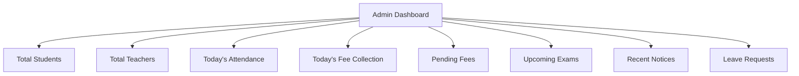

---

# 64. Parent Dashboard

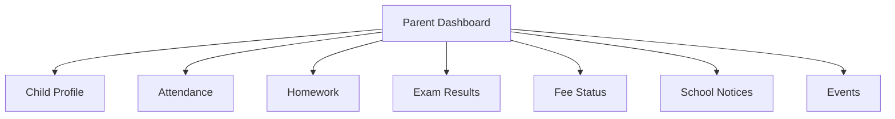

---

# 65. Teacher Dashboard

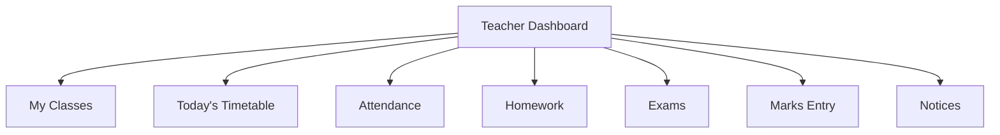

---

# 66. Recommended Database Technology

Use:

```text
PostgreSQL
```

Why?

Because the system has strong relationships between:

```text
Student
Parent
Class
Section
Subject
Attendance
Exam
Marks
Fees
Payments
Teacher
```

PostgreSQL gives:

- Foreign keys
- Transactions
- Constraints
- Composite indexes
- JSONB
- Strong data integrity
- Excellent reporting capabilities

---

# 67. Recommended ORM

Use:

```text
Prisma
```

Architecture:

```text
React / Next.js
       ↓
REST API
       ↓
Node.js + TypeScript
       ↓
Prisma ORM
       ↓
PostgreSQL
```

---

# 68. Recommended Backend Structure

```text
backend/
│
├── src/
│   ├── modules/
│   │
│   ├── auth/
│   ├── users/
│   ├── students/
│   ├── parents/
│   ├── academics/
│   ├── attendance/
│   ├── timetable/
│   ├── homework/
│   ├── examinations/
│   ├── fees/
│   ├── employees/
│   ├── library/
│   ├── transport/
│   ├── inventory/
│   ├── notifications/
│   └── reports/
│
├── middleware/
├── guards/
├── utils/
├── config/
└── database/
```

---

# 69. Recommended Frontend Structure

```text
frontend/
│
├── src/
│   ├── pages/
│   ├── components/
│   ├── layouts/
│   ├── modules/
│   │
│   ├── students/
│   ├── academics/
│   ├── attendance/
│   ├── homework/
│   ├── examinations/
│   ├── fees/
│   ├── employees/
│   ├── library/
│   ├── transport/
│   └── reports/
│
├── services/
├── hooks/
├── stores/
├── types/
└── utils/
```

---

# 70. Development Order

Do not develop all modules simultaneously.

Recommended order:

## Phase 1 — Foundation

```text
1. PostgreSQL
2. Prisma
3. Authentication
4. Users
5. Roles
6. Permissions
7. School Settings
```

## Phase 2 — Academic Core

```text
8. Academic Years
9. Classes
10. Sections
11. Subjects
12. Employees
13. Teacher Assignments
14. Student Management
15. Parents
16. Student Enrollment
```

## Phase 3 — Daily School Operations

```text
17. Attendance
18. Timetable
19. Homework
20. Notices
```

## Phase 4 — Examination

```text
21. Exams
22. Exam Subjects
23. Marks
24. Grading
25. Report Cards
```

## Phase 5 — Finance

```text
26. Fee Categories
27. Fee Structures
28. Student Fees
29. Payments
30. Receipts
31. Fee Reports
```

## Phase 6 — Advanced Modules

```text
32. Library
33. Transport
34. Inventory
35. Leave
36. Documents
37. Certificates
38. Notifications
39. Events
```

## Phase 7 — Reports & Security

```text
40. Dashboard Analytics
41. Audit Logs
42. Export Reports
43. Backup
44. Security Hardening
```

---

# 71. Database Golden Rules

These rules must be followed during development.

### Rule 1

Never store passwords as plain text.

```text
password ❌

password_hash ✅
```

### Rule 2

Never use FLOAT for money.

```text
FLOAT ❌

DECIMAL(12,2) ✅
```

### Rule 3

Never delete academic history casually.

```text
Soft Delete / Archive ✅
```

### Rule 4

Do not store class directly in students.

```text
Student
   ↓
Enrollment
   ↓
Class + Section
```

### Rule 5

Use foreign keys.

### Rule 6

Use unique constraints where duplicate data is not allowed.

### Rule 7

Create indexes for frequently searched fields.

### Rule 8

Store files outside the database.

### Rule 9

Keep audit logs for important changes.

### Rule 10

All fee transactions must be traceable.

---

# 72. Final Database Architecture

```text
                         SCHOOL MANAGEMENT SYSTEM
                                  │
                                  │
                    ┌─────────────┴─────────────┐
                    │                           │
                AUTHENTICATION              SETTINGS
                    │                           │
              ┌─────┴─────┐                     │
              │           │                     │
            USERS       ROLES             SCHOOL SETTINGS
                          │
                    PERMISSIONS
                          │
        ┌─────────────────┼──────────────────┐
        │                 │                  │
     STUDENTS          EMPLOYEES          PARENTS
        │                 │                  │
        │                 │                  │
        └──────────┬──────┴───────┬──────────┘
                   │              │
                   ↓              ↓
             ACADEMICS       TEACHER ASSIGNMENT
                   │
       ┌───────────┼────────────┐
       ↓           ↓            ↓
   CLASS/SECTION SUBJECT    ENROLLMENT
                               │
                ┌──────────────┼──────────────┐
                ↓              ↓              ↓
           ATTENDANCE       HOMEWORK        EXAMS
                                                │
                                                ↓
                                              MARKS

                    STUDENT
                       │
          ┌────────────┼────────────┐
          ↓            ↓            ↓
        FEES        LIBRARY      TRANSPORT
          │
          ↓
       PAYMENTS

        EMPLOYEES
           │
      ┌────┼────┐
      ↓    ↓    ↓
   ATTENDANCE LEAVE PAYROLL

                  SYSTEM
                    │
            ┌───────┼────────┐
            ↓       ↓        ↓
        DOCUMENTS NOTICES  AUDIT LOGS
```

---

# 73. Final Table Dependency

The core dependency should be understood as:

```text
ACADEMIC YEAR
      │
      ├── CLASS
      │     │
      │     ├── SECTION
      │     └── SUBJECT
      │
      └── STUDENT ENROLLMENT
              │
              └── STUDENT
                    │
          ┌─────────┼─────────┐
          │         │         │
      ATTENDANCE  EXAMS     FEES
                    │         │
                  MARKS    PAYMENTS
```

This is the **core of the entire School Management System**.

---

# 74. MVP Database

If the first version needs to be developed quickly, start with these tables:

```text
users
roles
permissions
role_permissions

students
parents
student_parents

academic_years
classes
sections
subjects
class_subjects
student_enrollments

employees
teacher_assignments

attendance

timetable_periods
timetable

homework
homework_submissions

exams
exam_subjects
exam_marks
grading_systems
grade_rules

fee_categories
fee_structures
student_fee_assignments
fee_payments
fee_payment_items

school_settings
audit_logs
```

After this is stable, add:

```text
Library
Transport
Inventory
Leave
Documents
Certificates
Notifications
Events
```

---

# 75. Final Recommendation

For this **single-school project**, the most important database relationship is:

```text
                    STUDENT
                       │
                       ↓
              STUDENT ENROLLMENT
                       │
          ┌────────────┼────────────┐
          ↓            ↓            ↓
    ACADEMIC YEAR     CLASS       SECTION
                       │
                       ↓
                    SUBJECT
                       │
                       ↓
                  TEACHER
```

Everything else connects around this academic structure:

```text
Student
   │
   ├── Attendance
   ├── Homework
   ├── Examination → Marks
   ├── Fees → Payments
   ├── Library
   ├── Transport
   ├── Documents
   └── Certificates
```

This structure should be treated as the **base database architecture** before starting frontend screens or API development.